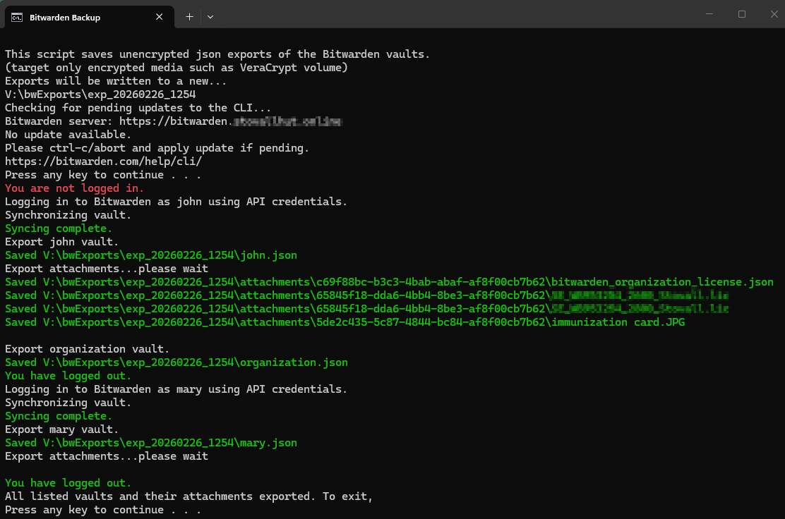

# bitwarden-cli-vault-backup
Windows batch file to back up multiple Bitwarden vaults (and optional organization vault) using the Bitwarden CLI — without manual login, 2FA prompts, etc. Just double-click the file in Windows Explorer and you're done.

## Overview

This script is intended for small personal or family Bitwarden setups.

It:
- Logs into one or more vaults using API credentials
- Unlocks each vault using the configured master password
- Exports unencrypted JSON for each vault
- Optionally exports an organization vault
- Downloads all attachments
- Writes everything to a timestamped directory

All operations are performed using the official Bitwarden CLI.

## Security warning

This script creates **unencrypted JSON exports** of your vault data.

You should:
- Store this script on encrypted media (e.g. VeraCrypt)
- Store `config.bat` only on encrypted media
- Store all export output only on encrypted media
- Protect your API keys and master passwords carefully

Do not store credentials or exports on unencrypted storage.

## Requirements

- Windows 10 or Windows 11
- Bitwarden CLI: https://bitwarden.com/help/cli/
- jq (command-line JSON processor): https://jqlang.github.io/jq/

Both `bw.exe` and `jq.exe` must be available on your system PATH.

## Steps to make backups

1. Mount your veracrypt volume.
2. In Windows explorer double-click your backupBitwarden.bat file.
3. Let the script complete.

4. Unmount your VeraCrypt volume.

## Setup

1. Clone or download this repository.
2. Copy `config-template.bat` to `config.bat`.
3. Edit `config.bat` and configure:
   - `B_OUTPUT_PARENT`
   - `B_VAULTS`
   - Per-vault variables:
     - `?_NAME`
     - `?_CLIENTID`
     - `?_CLIENTSECRET`
     - `?_MASTER_PW`
   - Optional `ORGANIZATION_ID`
4. Run:

```text
backupBitwarden.bat
```

## Output structure

Exports are written to:

```text
<output-parent>\exp_YYYYMMDD_HHMM\
```

Example:

```text
bwExports\
  exp_20260226_1254\
    john.json
    mary.json
    organization.json
    attachments\
      <item-id>\
        <attachment files>
    debug\
      items_<vault>.json
      attlist_<vault>.txt
```

The `debug` folder contains intermediate files used to enumerate attachments.

## Notes

- The Bitwarden CLI remembers its last configured server endpoint.
- This script does not modify the CLI server configuration.
- Attachment downloads may take time for large vaults.
- This script is provided as-is. Review the code before using it in your environment.

## License

MIT

